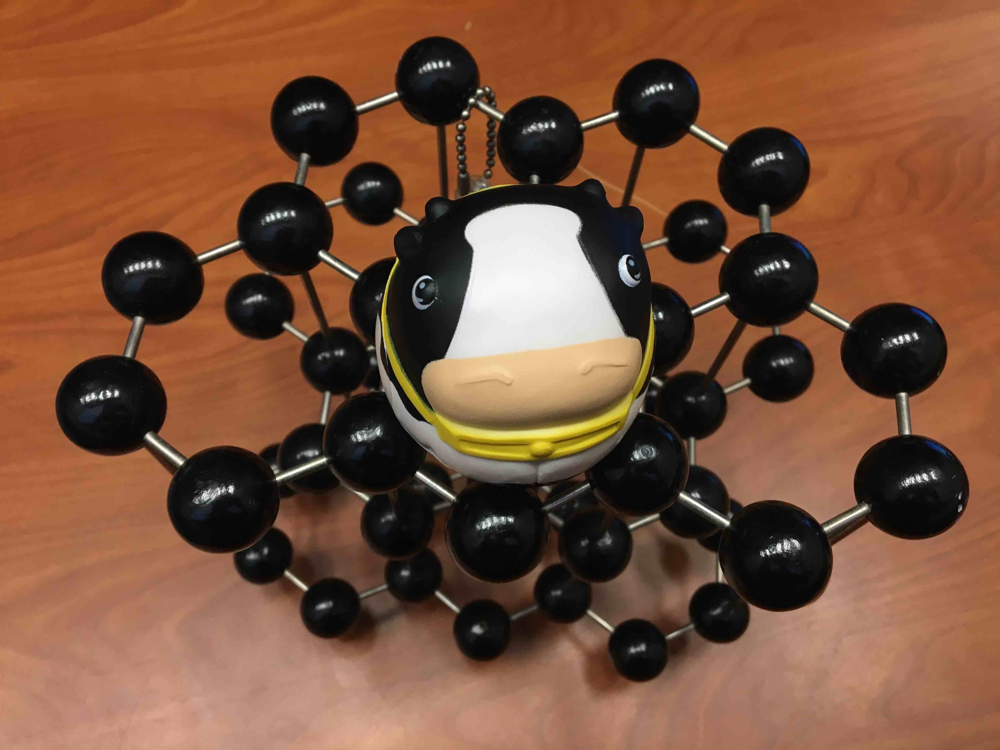

Title: About
Date: 2024-04-14 16:20
Category: About

   

<i>Ph.D. <a href="http://www.cornell.edu">Cornell University</a>  

B.A. <a href="http://www.carleton.edu">Carleton College</a> </i> 

I use physics to make complex problems more tractable.*  I enjoy working with <a href="research.html">interdisciplinary teams</a> on research questions that support the sustainable energy transition, including science and social justice aspects. <a href="cv.html">Learn more about my activities here</a>.

Those who work in my research group gain valuable generalist training in materials physics to address <a href="projects.html">timely fundamental and applied research challenges</a>. Much of our recent work relates to solid forms of carbon-rich materials, including carbonate minerals and biochar.

 Get a taste of what we do: watch this <a href="https://www.youtube.com/watch?v=leOXt4VeFt8">promotional video</a>.

 

<a href="https://kpoduska.github.io/PoduskaLab/pages/teaching.html">Experiential learning</a> and <a href="advocacy.html">science advocacy</a> are at the core of my research and teaching.

NEW! MSc positions available to support the development of nitrogen-functionalized biochar for carbon capture and low-carbon materials.
<a href="acbc_msc.html">The call for applicants is available here and will remain open until the position is filled.</a>

NEW! MSc/PhD positions available to support marine carbon dioxide removal research.
<a href="tca_mcdr.html">The call for applicants is available here and will remain open until the position is filled.</a>

   

<i>* Do you know the spherical cow joke in physics? <a href="https://en.wikipedia.org/wiki/Spherical_cow">Read it here.</a> This joke pokes fun at physicists, but it's one that we share around within the discipline to highlight what makes our approach to problems somewhat unique: by simplifying a problem, we can make it easier to get a useful answer. What's important here is that we know that we're not getting all of the details right -- we focus instead on getting a result that helps us move forward in our thinking, our planning, and our understanding. This at the core of how I do my research. It's a powerful approach!</i>

