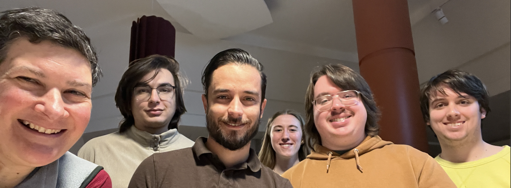

Title: Group
Date: 2024-09-14 16:20
Category: Group

<h1>The Poduska Research Group </h1>

Return to <a href="research.html">Research</a>

<!---Original: Height = "400" --->

Students make this research possible! My research group benefits from students with diverse academic backgrounds, including physics, applied math, chemistry, engineering, earth science, and archaeology. Some students have had extensive research experience, while others are experiencing the thrills and challenges of research for the first time. 

If you are interested learning more about research as part of <i>your</i> educational experience, please go here to <a href="research.html">find out what opportunities are currently available</a>. 

<h2>Current Research Team</h2>

<b>Kaitlyn Crawley, B.Sc. student </b>
 <i>E-mail: kcrawley_at_mun.ca</i>

<b>Brian Espinosa Acosta, Ph.D. student </b>
  M.Sc. Chemistry, <a href="http://www.mun.ca/">Memorial University</a>
  B.Sc. Chemistry, <a href="https://www.uh.cu/">Universidad de La Habana</a>
 <i>E-mail: bespinosaaco_at_mun.ca</i></li>

<b>Nasim Khazeni, Ph.D. student </b> (joint with <a href="https://www.cbu.ca/">Dr. Stephanie MacQuarrie</a>) 
 M.Sc. Chemistry, <a href="http://www.cbu.ca/">Cape Breton University</a> 
 <i>E-mail: nkhazeni_at_mun.ca</i>

<b>Afreen Mahiat, M.Sc. student </b> (joint with <a href="https://www.mun.ca/physics/our-people/faculty/dr-hilding-neilson/">Dr. Hilding Neilson</a>) 
 B.Sc.(Hon) Physics, <a href="http://www.mun.ca/">Memorial University</a> 
 <i>E-mail: amahiat_at_mun.ca</i>

<b>Kyle Pike, M.Sc. student </b>
 B.Sc.(Hon) Physics, <a href="http://www.mun.ca/">Memorial University</a> 
 <i>E-mail: kallanp_at_mun.ca</i>

<b>Jack Taj, Research Assistant </b> 
 B.Sc.(Hon) Physics,  <a href="http://www.mun.ca/">Memorial University</a>
 M.Sc. Scientific Computing,  <a href="http://www.mun.ca/">Memorial University</a> 
 <i>E-mail: ajtaj_at_mun.ca</i>

<b>Dan Twining, M.Sc. student </b> (joint with <a href="https://www.mun.ca/math/our-people/faculty/danny-dyer/">Dr. Danny Dyer</a> and <a href="https://sites.google.com/view/melissa-huggan/">Dr. Melissa Huggan</a>) 
 B.Sc. Math,  <a href="https://www.lssu.edu/">Lake Superior State University</a>
 <i>E-mail: dtwining_at_mun.ca</i>

<b>Baolin Wang, Post-doctoral Researcher </b> (based at Dalhousie University joint with <a href="https://sites.google.com/view/yang-efm-lab/about">Dr. Adam Jiankang Yang</a>) 

<b>Chloé Bédard, Ph.D. student </b> (based at Université du Québec à Rimouski joint with <a href="https://www.uqar.ca/professeurs/therriault-genevieve/">Dr. Geneviève Therriault</a>) 

<h2><a href="alumni.html"> Where are the alumni of the Poduska Research group now?</a></h2>

